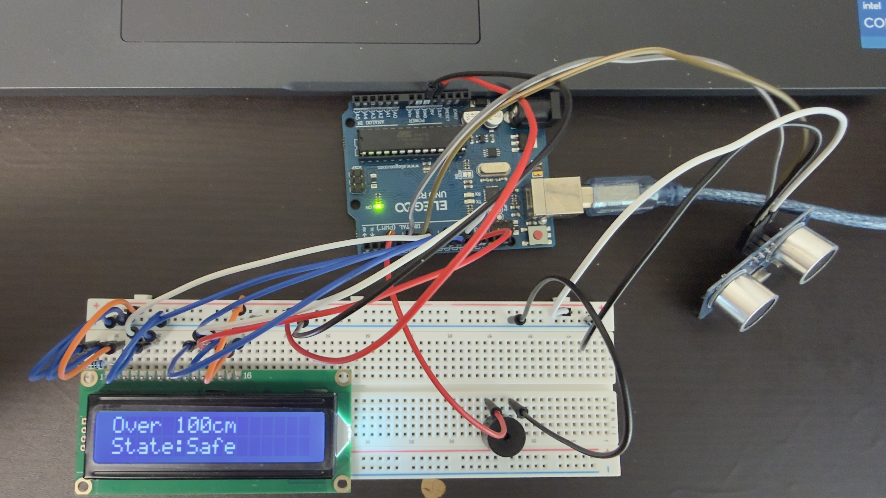

# 成果発表レポート

> 記入者: CHEN MINHAO
> グループ: !1-L
> 日付: 2026/05/27

> **📝 このレポートをそのまま発表原稿にできます。**
> 各セクションの指示を消して、自分の言葉で書いてください。
> 1人 **約2分**（グループ5人で10〜12分）に収まる分量が目安です。

---

## 1. 何を作ったか（30秒）

<!-- ひと言で伝わるように書いてください。「○○を使って、△△するガジェットを作りました。」 -->

**ガジェット名：** 簡易バックソナー表示装置

**ひと言で説明：** 超音波センサーで障害物までの距離を測定し、LCDとブザーで危険を知らせる装置です。

**使った部品：**
- Arduino UNO R3
- LCD1602
- Ultrasonic Sensor
- Passive Buzzer

---

## 2. 設計で考えたこと（15秒）

<!-- 要件定義・基本設計・詳細設計の中で、自分なりに考えたこと・工夫した点を書いてください -->
<!-- 「なぜこの部品を選んだか」「なぜこの構成にしたか」など、判断の理由を言葉にしてください -->
車のバックソナーをイメージし、距離によってSafe、Caution、Dangerを切り替える設計にしました。 
また、LCDには状態だけでなく距離も表示し、利用者が障害物までの距離を分かりやすく確認できるようにしました。 

---

## 3. できたこと・できなかったこと（30秒）

<!-- 正直に書いてください。「できなかった」も立派な成果です -->

**動いたもの：**
- 超音波センサーで距離を測定し、LCDに距離と状態を表示できました。
- また、距離が5cm未満のときはToo Close、20cm未満のときはDanger、20cm以上50cm未満のときはCaution、50cm以上のときはSafeとして動作しました。
- Cautionではブザーをゆっくり鳴らし、Dangerでは短い間隔、または近すぎる場合に連続音を鳴らすことができました。

**動かなかった・間に合わなかったもの：**
- 
- なぜ動かなかったか（わかる範囲で）：

---

## 4. 一番苦労したこと、どう乗り越えたか（30秒）

<!-- ここが発表の山場です。1つだけに絞って、ストーリーで書いてください -->

**何が起きたか：**
最初は、LCDに Safe、Caution、Danger などの状態だけを表示する予定でした。 
しかし、状態だけの表示では、利用者がどのくらい障害物に近づいているのか分かりにくく、警告の具体性が不足していると感じました。 

**どう対処したか：**
LCDには状態だけでなく、距離も cm 単位で表示するように仕様を変更しました。 通常時は測定した距離と Safe、Caution、Danger の状態を表示するようにしました。 
また、100cm以上の場合は細かい距離を表示せず、Over 100cm / State:Safe と表示することで、近すぎる場合は Too Close / State:Danger と表示しました。 

**そこから何がわかったか：**
今回の経験から、機能が正しく動くだけでなく、利用者にとって分かりやすい表示にすることも重要だと学びました。

---

## 5. 学んだこと・今後の展望（25秒）

<!-- 「勉強になった」ではなく具体的に。 -->
<!-- 例: 「AIが生成したコードをそのまま使ったら動かず、自分でprintfデバッグして原因を特定した」 -->
<!-- 例: 「配線図を書かずに組んだら混乱した。図を書いてからやり直したらすぐ動いた」 -->

**学んだこと：**
- センサー入力、LCD表示、ブザー出力を組み合わせることで、入力・処理・出力の流れを具体的に理解できました。

**今後の展望（この仕組みを発展させるなら）：**
<!-- 例: 「温度センサー＋モーターの組み合わせを応用すれば、室温に応じて自動で換気する仕組みが作れそう」 -->

- 距離の境界値を調整できるようにする
- 実車に近い環境でも安定して測定できるようにする

---

## 6. 発表で見せたいもの（メモ）

<!-- 動くデモ、配線の写真、設計図、フローチャート、AIとのやり取りのスクショなど -->
<!-- 動くものがなくても、「考えた過程」を見せられれば十分です -->

- 

---

> **💡 書き終わったら**
> - 声に出して読んで、2分に収まるか確認してください
> - 長すぎたら「4. 苦労したこと」を1つに絞りましょう
> - グループで導入・締めをつけたい場合は、次の時間に相談して決めてください
